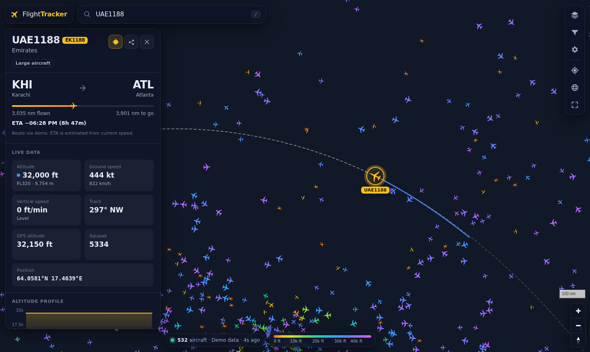

# ✈ Flight Tracker

A live, interactive map of air traffic around the world, in the style of Flightradar24.
Every tracked aircraft appears as a small plane icon, rotated to its heading and coloured by altitude.
Click any plane, or search for it by **flight number**, to see where it is going and how high and fast it is flying.


<sub>Screenshot taken in demo mode (simulated traffic; the build sandbox could not load map tiles).</sub>

## Features

- **The whole world, live.** Thousands of aircraft at once, drawn on the GPU (MapLibre GL). Positions are
  dead-reckoned between updates, so planes move smoothly instead of jumping.
- **Search by anything.** Type a ticket-style flight number (`BA117`, `PK785`, `EK 202`), an ICAO callsign
  (`BAW117`), a registration (`G-XLEA`, `N12345`), an ICAO hex code (`4CA7B5`) or a whole airline (`PIA`, `EK`,
  `Emirates`). The map flies to the plane, selects it and follows it. Flights that are not in the current view
  are looked up worldwide.
- **Flight details panel:**
  - callsign, IATA flight number and airline
  - origin → destination with a progress bar, distance flown and remaining, and an ETA based on current speed
  - barometric and GPS altitude (with flight level), ground speed, vertical speed (climbing or descending), track
  - squawk, with alerts for 7500, 7600 and 7700
  - aircraft type, registration, ICAO hex, operator and country
  - a photo of the aircraft
  - an interactive altitude profile chart
- **Flight path.** The selected flight shows its trail coloured by altitude, plus great-circle lines to its
  origin and destination airports.
- **Filters.** Altitude range, airliners, light aircraft, helicopters, aircraft on the ground, military only,
  and airline / callsign prefix.
- **Map options.** Dark, light, streets and satellite maps, a 3D globe, flight labels, and trails for every aircraft.
- **Units.** Aviation (ft, kt), metric (m, km/h) or imperial (ft, mph).
- **Shareable links.** `/?flight=BA117` opens straight onto that flight. The share button copies the link.
- **Keyboard shortcuts.** <kbd>/</kbd> search · <kbd>Esc</kbd> close · <kbd>F</kbd> follow · <kbd>W</kbd> whole world.
- **Works on phones.** On small screens the details open as a bottom sheet.

## Quick start

Requires **Node.js 18.17+**. There are no dependencies to install.

```bash
npm start            # live data   → http://localhost:8080
npm run demo         # simulated traffic, no internet needed (for development)
npm test             # unit tests
```

## Where the data comes from

I compared the free sources available today. **Browsers can't call any of them directly** because
none send CORS headers, so `server.js` fetches the data, merges it into one format, caches it and serves it to the app.

| Source | Used for | Notes |
|---|---|---|
| [OpenSky Network](https://opensky-network.org/) | Snapshot of the **whole world** in one request (zoomed-out view) | Anonymous: 400 credits/day (a world snapshot costs 4). A free account gives 4,000+/day. |
| [adsb.lol](https://adsb.lol/) | **Detailed live view** of the area you're looking at (≤ 250 nm). Worldwide search by callsign, registration or hex. Routes. | Unfiltered community ADS-B/MLAT feed (ODbL). Includes registration, aircraft type and military flag. |
| [airplanes.live](https://airplanes.live/) · [adsb.fi](https://adsb.fi/) | Automatic fallbacks for adsb.lol | Same readsb data format. A feed that fails is skipped for a cool-down period. |
| [adsbdb.com](https://www.adsbdb.com/) | Origin and destination by callsign, aircraft details | Free and open |
| [planespotters.net](https://www.planespotters.net/) | Aircraft photos | Photos credited to their photographers |
| [CARTO](https://carto.com/basemaps) · [Esri](https://www.esri.com/) | Base maps (dark, light, streets, satellite) | |

How a request is answered:

1. **Zoomed in** (the view fits in a 250 nm circle): the regional feed (adsb.lol → airplanes.live → adsb.fi)
   is polled every 5 s. This is near real-time and has the richest data.
2. **Zoomed out:** the OpenSky world snapshot is filtered to your view. It is merged with the regional feed
   around the map centre, which keeps the area you are looking at fully live.
3. **Search** checks the world snapshot, then asks the community feeds worldwide by callsign, registration or hex.
   It converts IATA flight numbers to ICAO callsigns using a built-in table of about 210 airlines
   (`public/js/airlines.js`). Searching `PK785` looks for `PIA785`.

### Get more frequent world updates (recommended)

Without an account, OpenSky allows about 100 world snapshots a day, so the server refreshes the zoomed-out
world view only every 5 minutes. Planes still move smoothly because their positions are extrapolated.
For a world view that refreshes every minute:

1. Create a free account at [opensky-network.org](https://opensky-network.org/).
2. Go to **Account → API client** and create a client.
3. Start the server with the client's credentials:

```bash
OPENSKY_CLIENT_ID=your-client-id OPENSKY_CLIENT_SECRET=your-secret npm start
```

### Configuration

| Variable | Default | Meaning |
|---|---|---|
| `PORT` | `8080` | HTTP port |
| `HOST` | `0.0.0.0` | Interface to listen on |
| `OPENSKY_CLIENT_ID` / `OPENSKY_CLIENT_SECRET` | – | OpenSky API client (OAuth2 client-credentials) |
| `OPENSKY_REFRESH_SEC` | `60` with an account, `300` without | How often to refresh the world snapshot |
| `DEMO` | – | `1` = simulated traffic (no network) |
| `DEMO_AIRCRAFT` | `4000` | Number of simulated aircraft |

## Android app (APK)

The `android/` folder wraps the same web app in a native Android shell (Android 6.0+), **with no server needed**.
On the phone, the API in `lib/api.js` runs inside the app. HTTP requests go through native Android code
(`NativeHttp` in `MainActivity.java`), which is not subject to the CORS restrictions that browsers apply.

```bash
# Ubuntu/Debian prerequisites: a JDK plus
sudo apt install android-sdk-platform-23 android-sdk-build-tools dalvik-exchange
npm run android      # → android/build/FlightTracker.apk
```

The build doesn't use Gradle (aapt2 → javac → dx → zipalign → apksigner) and signs the APK with a
locally generated debug key. To install it, copy the APK to your phone and allow "Install unknown apps".
On the phone the app behaves like the website: the back button closes panels and deselects flights,
external links open in your browser, and "my location" asks for location permission.

## Deploying

The app is a single Node process with no dependencies. It runs on any host that can run Node,
such as Render, Railway, Fly.io or a small VPS:

```bash
docker build -t flight-tracker .
docker run -p 8080:8080 -e OPENSKY_CLIENT_ID=... -e OPENSKY_CLIENT_SECRET=... flight-tracker
```

GitHub Pages on its own **won't work**, because the data sources need the server (CORS, caching, API credentials).

## Project layout

```
server.js              HTTP server + JSON API (/api/aircraft, /api/search, /api/route, /api/details, /api/track, /api/status)
lib/providers.js       Upstream sources: OpenSky world snapshot, community feeds with fallback, routes, photos
lib/normalize.js       Converts every source into one compact aircraft format; geo helpers
lib/cache.js           TTL cache with request de-duplication
lib/demo.js            Simulated traffic for DEMO=1
public/index.html      App shell
public/js/app.js       Map, live updates, selection, search, filters, details panel
public/js/icons.js     Aircraft silhouettes rendered as SDF icons (tinted by altitude on the GPU)
public/js/format.js    Units, altitude colours, geo maths
public/js/airlines.js  IATA ↔ ICAO airline table (shared by server and browser)
public/js/native-http.js  fetch() over the Android native bridge
lib/api.js             The JSON API itself (shared by server.js and the Android app)
android/               Android shell (MainActivity.java), resources and build.sh
```

## Notes and limits

- **Coverage** depends on volunteer receivers. It is excellent over Europe, North America and much of Asia,
  and patchy over oceans and remote areas. Commercial trackers fill those gaps with satellite ADS-B, which has no free source.
- **Routes** (origin and destination) come from community databases keyed by callsign. They can be out of date.
  The app checks each route against the plane's actual position and warns when the two don't match.
- Please be gentle with the free community APIs. The server caches and de-duplicates requests, so many
  browsers viewing the same area share one upstream request.
